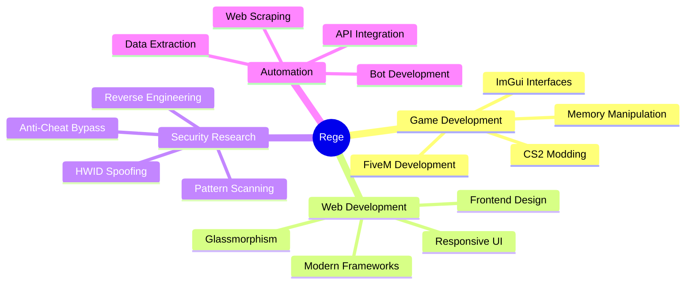

<div align="center">

# 👋 Terve, I'm Rege


[](https://github.com/rege-dev)

</div>

---

## 🚀 About Me

```typescript
const rege = {
    location: "Finland 🇫🇮",
    code: ["C#", "C++", "Python", "JavaScript", "Lua"],
    focus: ["Game Development", "Security Research", "Web Development"],
    currentlyLearning: ["Advanced Memory Manipulation", "Reverse Engineering"],
    interests: ["FiveM Modding", "CS2 Development", "Web Design", "Automation"],
    funFact: "I turn coffee into code ☕"
};
```

---

## 💻 Tech Stack

<div align="center">

### Languages


### Frameworks & Tools


### Development Tools


</div>

---

## 🎯 Current Projects

<div align="center">

| Project | Description | Tech Stack |
|---------|-------------|------------|
| 🎮 **CS2 Cheat** | Advanced game modification with ImGui interface | C#, ImGui, Memory Manipulation |
| 🚗 **FiveM Mods** | Custom server-side and client-side modifications | Lua, C#, JavaScript |
| 🌐 **Web Projects** | Modern, responsive web applications | HTML, CSS, JavaScript, React |
| 🔧 **Automation Tools** | Image scrapers, web crawlers, and utilities | Python, Selenium |
| 🛡️ **Security Tools** | HWID spoofers and security research projects | C++, Assembly |

</div>

---

## 📊 GitHub Stats

<div align="center">


</div>

<div align="center">


</div>

---

## 🏆 GitHub Trophies

<div align="center">


</div>

---

## 🔥 Recent Activity

<!--START_SECTION:activity-->
<!--END_SECTION:activity-->

---

## 💡 Featured Skills

<div align="center">



</div>

---

## 📫 Connect With Me

<div align="center">

[](https://github.com/rege-dev)
[](https://discord.com)

</div>

---

<div align="center">

### 💭 Random Dev Quote


### 🐍 Contribution Graph


---


**⭐️ From [rege-dev](https://github.com/rege-dev) with ❤️**

</div>
